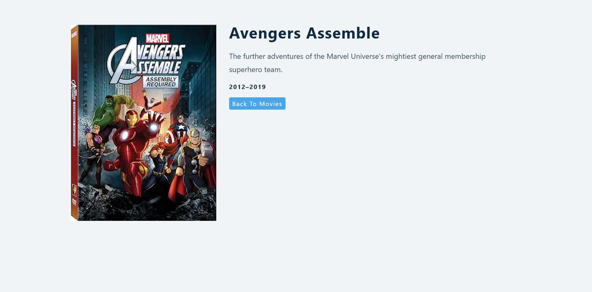

# Movie Database App

A modern, responsive React application that allows users to search and explore movies using the OMDB API. Built with React 18, React Router, and Context API for efficient state management.

## Features

- 🔍 **Real-time Movie Search** - Search for movies by title with instant results
- 🎬 **Movie Grid Display** - Browse movies in a beautiful, responsive grid layout
- 📄 **Detailed Movie Information** - View comprehensive details including plot, cast, ratings, and more
- 🎨 **Modern UI Design** - Clean, premium interface with smooth animations and glassmorphism effects
- 📱 **Fully Responsive** - Optimized for all device sizes
- ⚡ **Custom React Hooks** - Utilizes custom `useFetch` hook for API calls
- 🌐 **Context API** - Centralized state management for seamless data flow
- 🚀 **Fast Performance** - Optimized rendering and efficient data fetching

## Screenshots

````carousel

<!-- slide -->

````

## Technologies Used

- **React** 18.2.0 - Modern UI library
- **React Router DOM** v5.2.0 - Client-side routing
- **OMDB API** - Movie database API
- **Context API** - State management
- **Custom Hooks** - Reusable logic with `useFetch`
- **CSS3** - Modern styling with animations and responsive design

## Installation

1. **Clone the repository**
   ```sh
   git clone <repository-url>
   cd movie-db
   ```

2. **Install dependencies**
   ```sh
   npm install
   ```

3. **Set up environment variables**
   
   Create a `.env` file in the root directory:
   ```env
   REACT_APP_MOVIE_API_KEY=your_omdb_api_key_here
   ```

4. **Start the development server**
   ```sh
   npm start
   ```

   The app will open at [http://localhost:3000](http://localhost:3000)

## Environment Setup

### Getting Your OMDB API Key

1. Visit [OMDB API](https://www.omdbapi.com/apikey.aspx)
2. Select the free tier (1,000 daily requests)
3. Enter your email address
4. Check your email for the API key
5. Add the API key to your `.env` file as `REACT_APP_MOVIE_API_KEY`

> [!IMPORTANT]
> Never commit your `.env` file to version control. Make sure it's listed in `.gitignore`.

## Usage

1. **Search for Movies**
   - Enter a movie title in the search bar
   - Results update automatically as you type
   - The default search shows "Avengers" movies

2. **View Movie Details**
   - Click on any movie card to view detailed information
   - See plot summary, cast, director, ratings, and more
   - Use the back button to return to search results

3. **Navigate**
   - Home page (`/`) - Search and browse movies
   - Movie details (`/movie/:id`) - View individual movie information

## Project Structure

```
movie-db/
├── public/
│   └── screens/          # Application screenshots
├── src/
│   ├── App.js           # Main app component with routing
│   ├── Home.js          # Home page wrapper
│   ├── Movies.js        # Movie grid display component
│   ├── SearchForm.js    # Search input component
│   ├── SingleMovie.js   # Movie details page
│   ├── context.js       # Context API setup and provider
│   ├── useFetch.js      # Custom hook for API calls
│   ├── index.js         # App entry point
│   └── index.css        # Global styles
└── package.json
```

### Key Components

- **App.js** - Sets up routing between home and movie details pages
- **context.js** - Provides global state (movies, loading, error, query)
- **useFetch.js** - Custom hook for fetching data from OMDB API
- **Movies.js** - Renders the movie grid with search results
- **SingleMovie.js** - Displays detailed information for a selected movie
- **SearchForm.js** - Handles user input for movie searches

## Available Scripts

### `npm start`
Runs the app in development mode at [http://localhost:3000](http://localhost:3000)

### `npm build`
Builds the app for production to the `build` folder

### `npm test`
Launches the test runner in interactive watch mode

### `npm eject`
**Note: this is a one-way operation. Once you eject, you can't go back!**

## API Reference

This application uses the [OMDB API](https://www.omdbapi.com/) for movie data.

**Endpoints used:**
- Search movies: `/?apikey={key}&s={query}`
- Get movie details: `/?apikey={key}&i={imdbID}`

## License

This project is open source and available for educational purposes.

---

Built with ❤️ using React
